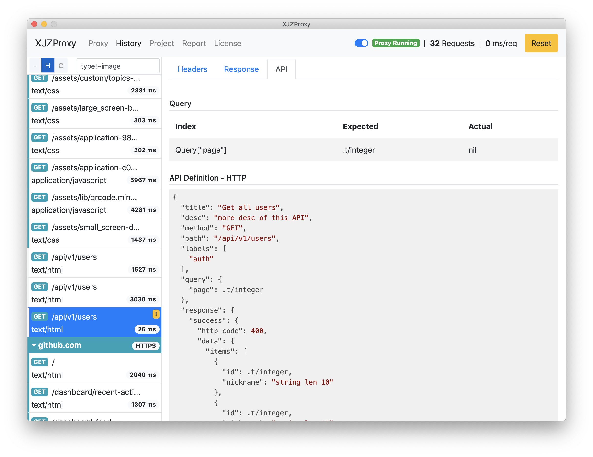
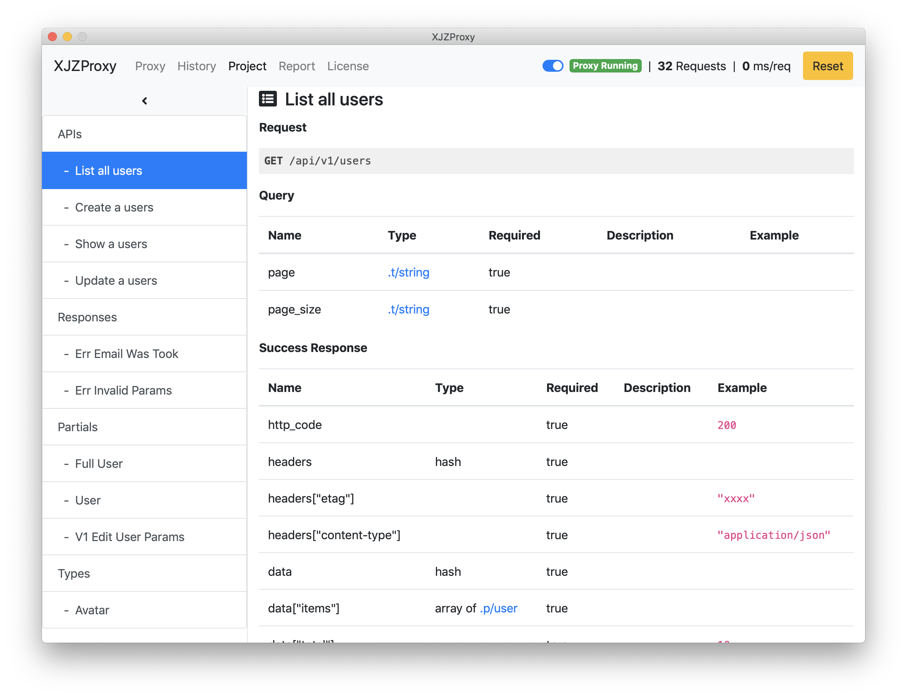

## 功能

* HTTP/HTTPS/HTTP2/GRPC 请求代理
* 按 host, connection 分组请求历史
* 简单的搜索语言过滤请求历史
* 自动生成接口文档预览
* 自动生成响应数据
* 自动对比请求、响应数据，并显示差异
* 按过滤结果生成相应的错误统计


## 介绍

一个工具可以让你用文档去检查接口，用文档去接受请求并返回定义的数据。


也许你的工作流是这样的

1. 创建接口文档
2. 接口开发者按文档写代码
3. 接口使用者按文档写代码，但还需要自己的生成假数据
4. 开发者完成接口开发并部署测试服务器。然后发现接口和文档对不上，或使用者没有按文档传调用参数。
5. 更新文档，然后继续第四步。


在这个例子中，文档只是一个约定。开发者和用户只能等到所有接口可以调用时才能知道接口调用是没问题的。

基于以上，我们开发了一个工具，让文档成为真实有效的契约。开发者保证自己的接口是和文档上一样的参数及返回数据格式。用户根据文档直接请求去调用接口，并确保自己的调用参数是符合文档约定的。


## 界面预览






## 项目文档规范

[中文](./SPEC-zh-cn.md) |
[English](./SPEC.md)


## 快速上手

### 启动软件

打后软件后右上可以看到 `Proxy Runnning`，如果是 `Proxy Stopped` 状态，请在 `Proxy` 中检查更换默认端口再将开关切换到启动


### 创建接口项目

在 `~/home/XJZProxy`（默认项目目录，可修改）下创建一个项目目录 `my_project`

然后添加一个配置文件，以 `.yml` 为后缀，比如 `~/home/XJZProxy/my_project/app.yml`


```yaml

project:
  url: https://xjz.pw # 默认代理只处理项目中 url 匹配的请求

partials:
  user: # 定义一个用户模板，后面可以通过 `.p/user` 引用。可以定义任何形式的数据。
    id: .t/integer
    nickname: string len 10

responses:
  list_users:
    http_code: 400
    data:
      # `.p/user * 2` 生成一个数组，里面两个 user 模板定义的元素
      # [ {id: x1, nickname: y1}, {id: x2, nickname: y2} ]
      items: .p/user * 2
      total: 2
    
apis:
  - title: Get all users # 必须的
    desc: more desc of this API # 可选的
    method: GET
    path: /api/v1/users # 当请求匹配 method 和 path 时，就会返回 response['success'] 中的数据
    labels: ['auth']
    query:
      page: .t/integer # 定义请求时必须传 page 参数在 query 中，类型为 integer
    response:
      success: .r/list_users # 必须的默认响应数据
      error: 
        http_code: 400
        data:
          code: 1
          msg: Invalid page
```

文档保存后几秒，将会出现提示加了新的项目，现在可以在 `Project` 中查看项目对应的文档了。如果定义格式有问题，也会在文档中显示错误信息。


确认正确后，通过代码访问对应的接口将返回定义好的数据内容

```
curl http://xjz.pw/api/v1/users --proxy localhost:9898
```

如果要使用 HTTPS ，在 `Proxy` 中复制 Root CA URL，并打开浏览器下载安装。
